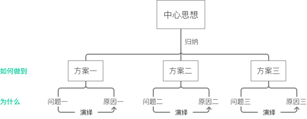

# 金字塔原理导读

> 我快速阅读了《金字塔原理》这本书的前半部分，更多的是针对如何才能更好的进行表达。目前比较受启发的在于两点
>
> 1. 结论先行的方式能够提高表达效率，先写结论，然后阐述对应的问题和原因
> 2. 在金字塔较高结构层次中使用归纳法，在较低层次中使用演绎法

### 核心思想

- 先结论后原因，先结果后过程
- 先重要后次要，先全局后细节
- 归类分组，逻辑递进

 

